# HUD

## Criando a HUD basica de um personagem

Neste exemplo vamos inserir uma HUD básica de **VIDA** do personagem.
- Primeiramente criamos um evento de **Dano** na blueprint do personagem:

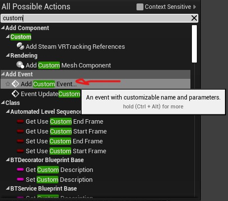

Logo após, criamos uma variável tipo **float** com o nome **Vida**;
Em seguida seguimos com a lógica do Dano:

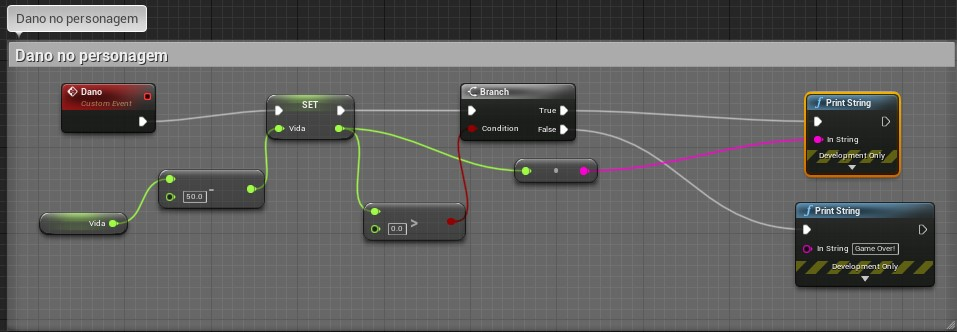

Com a lógica do **Evento Dano** pronta, seguimos para a criaçao da HUD;

Criamos uma Blueprint Widget para mostrar a vida do persongem na tela. Então para isso:

Criar uma Widget:
- Aperte o botão direito do mouse no content Browser:

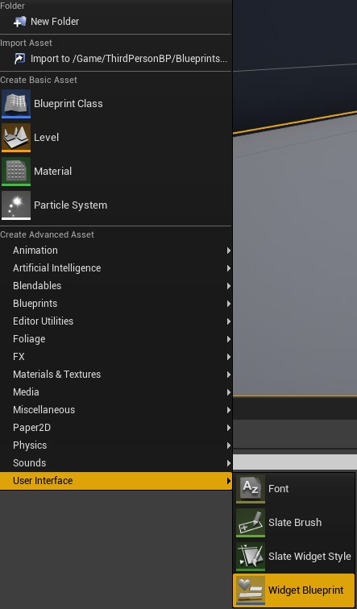

- Nomeamos como BP_WidgetHUDHeroi: 

- Em seguida, abra o blueprint criado:

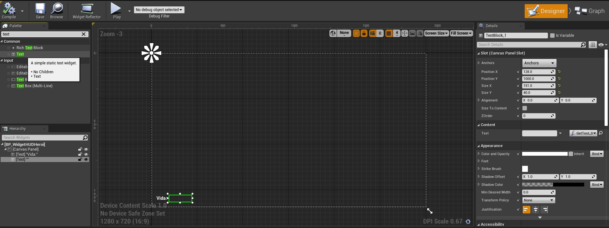

- Arraste o text até a tela tracejada, no exemplo acima foi inserido dois Texts, onde um foi nomeado com Vida e o outro em branco onde será realizado uma **bind** onde será mostrado a vida do personagem;

- No text destacado na imagem acima, é feito uma **bind**:

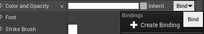

Ao criar a bind, será levado até a área de Graph da widget;

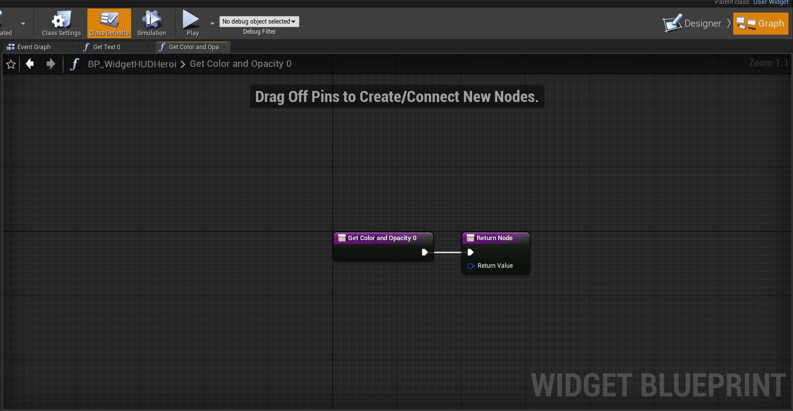

Em seguida, no Event Graph do Blueprint do persongem:

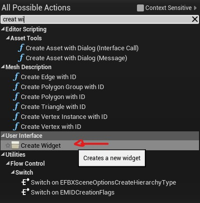

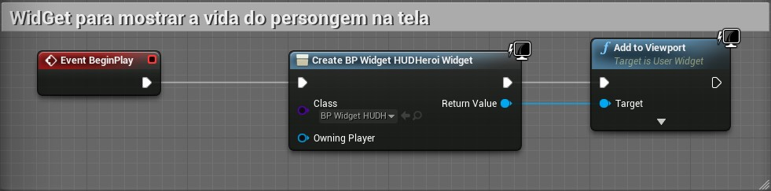

Após isto, voltar ao **BP_WidgetHUDHeroi**:

No Event Graph do Widget:

- Criar a referência ao personagem:

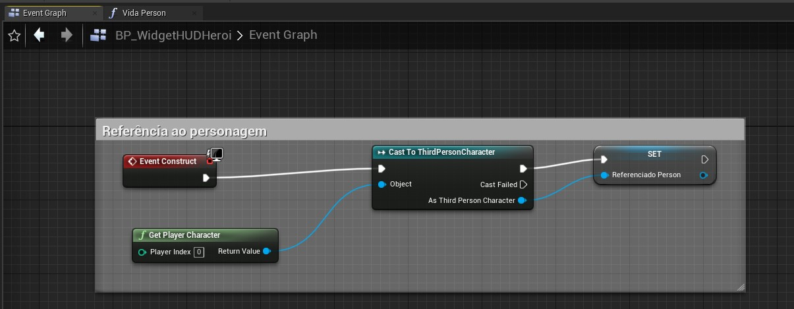

em seguida, inserir a referência:

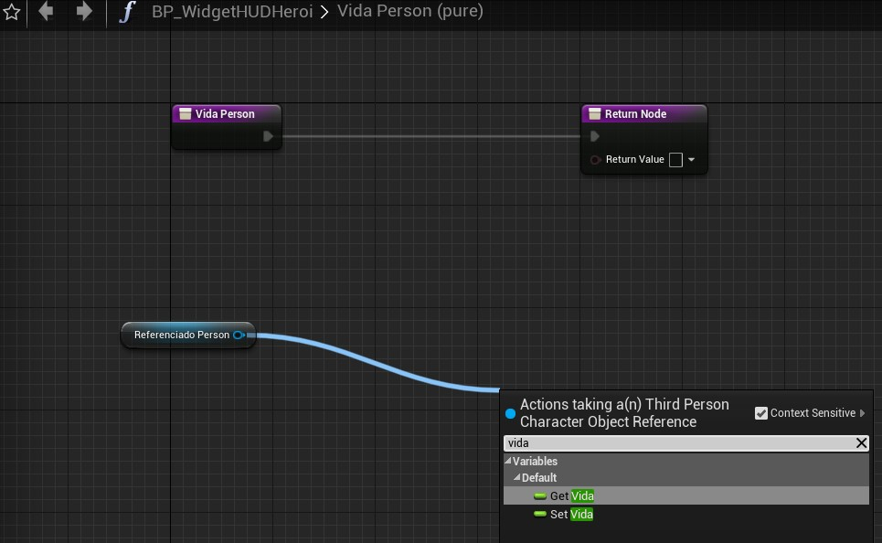

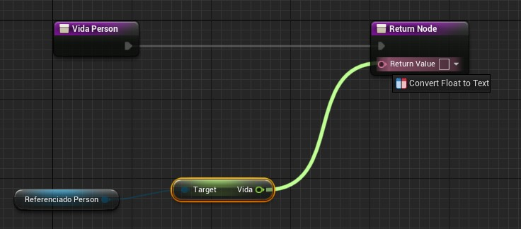

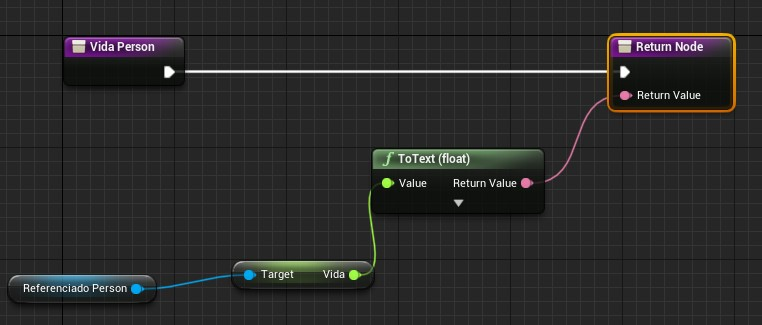

Em seguida, salvar e compilar;

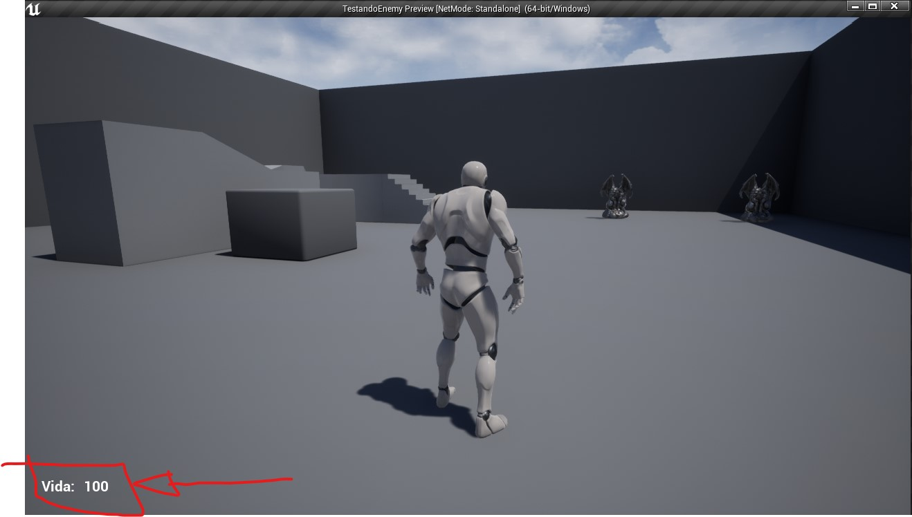
HUD no viewport.
